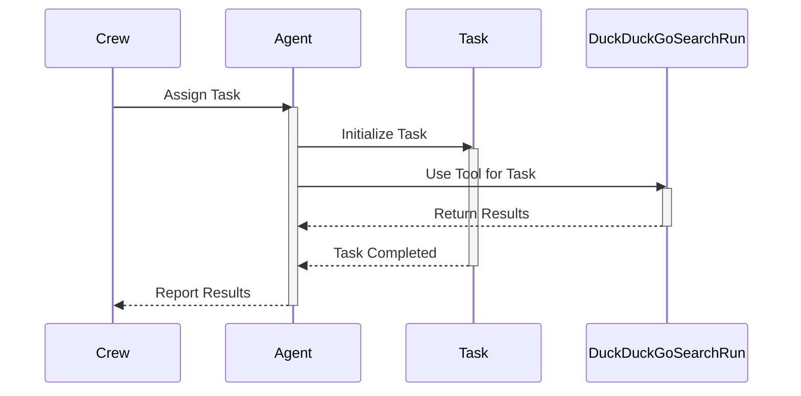
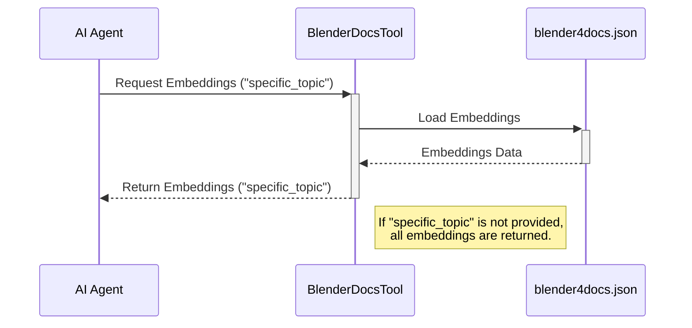

<head>
  <meta name="keywords" content="AI, Research, Intelligence" />
  <meta name="twitter:card" content="summary_large_image" />
  <script type="application/ld+json">
    {JSON.stringify({
      '@context': 'https://schema.org/',
      '@type': 'Organization',
      name: 'My AI Agents',
      url: 'https://other.ivanryan.dev/blog/My-AI-Agents', 
      logo: '/img/meme0001.png',
    })}
  </script>
</head>

import AudioPlayer from '../src/components/AudioPlayer'


I have been interested in AI Agents that can research, develop and test code continuously even in an offline environment. So when I saw baby-agi and CrewAI I started testing them right away. But I ended up going with CrewAI because of the ability to use Ollama

I started out letting AI Agents surf the web using DuckDuckGo, grabbing HTML content from websites, executing python code in a restricted docker container. 

It is pretty interesting and fun to watch these agents work and solve problems. But its time for some more advanced projects and use cases and test the limits.

## Daily Intelligence Reports

I have been working on a project to generate daily intelligence reports for military and political events. 
The reports are generated by AI Agents that gather information from multiple web sources and process it into a structured report. 
The report is then formatted to be readable by the TTS model.

I have been using [Coqui-TTS](https://github.com/coqui-ai/TTS) to generate the narrated audio for the reports.

Here is a example of a report generated by the AI Agents and narrated by the `tts_models/en/vctk/vits` model. 
Generated on recent evens in the country of Niger using DuckDuckGo.

<AudioPlayer src="https://f004.backblazeb2.com/file/ivans-web-s3/intel-report-voices/niger-reports-2024/001/cc8133dd-4947-4c95-82a7-8a8b41d649cf.wav" />

This is a very basic example of what can be done with AI Agents and TTS models. I hope to expand on this project and make it more advanced.

## a simple research agent example
 
I am in junior year of college and I need to write alot of essays, discussion posts and research papers. What other tool to use than AI Agents to help me with my research!

**Scenerio 1:** Lets say I have to write a 8-page paper on the Pfsense vs OPNsense firewalls (even though OPNsense is the best 😉). 
I can use AI Agents to gather information from multiple sources using DuckDuckGo 
from the LangChain tools, and give me a headstart on research. 


### Lets write some code

I will give you a basic example of how to use CrewAI, DuckDuckGo and Ollama to accomplish the tasks of researching Pfsense vs OPNsense and then writing a comparative analysis.

This requires Ollama to be setup and running, if you don't have Ollama setup [check out my tutorial on how to setup Ollama](/docs/ollama-setup) for both Linux (AMD/Nvidia) and Windows (Nvidia).

In this instance I will be using *virtualenv* to create a virtual python environment for the project. If you dont have virtualenv installed you can install it normally using `pip` [if your system will let you](/docs/python-externally-managed-environment).

```bash
virtualenv ai-agents
source ai-agents/bin/activate
pip install crewai langchain-community python-dotenv
pip install 'crewai[tools]' # Optional
```

Now lets create a file called `main.py` and add the following code.

```python
# main.py

import os
from crewai import Agent, Task, Crew, Process
from langchain_community.tools import DuckDuckGoSearchRun
from dotenv import load_dotenv

load_dotenv()

# Create an instance of the DuckDuckGoSearchRun tool
search_tool = DuckDuckGoSearchRun()

# Define a network security researcher agent
network_security_researcher = Agent(
    role='Network Security Research Analyst',
    goal='Investigate the features, performance, and community support of pfSense and OPNsense',
    backstory="""You are a network security expert tasked with evaluating pfSense and OPNsense. Your goal is to understand their strengths,
    weaknesses, and suitability for different network environments. This includes analyzing their features, performance benchmarks,
    community support, and the frequency of updates.""",
    verbose=True,
    allow_delegation=False,
    tools=[search_tool],
)

# Define a technical content writer agent
technical_writer = Agent(
    role='Technical Content Writer',
    goal='Compose a comparative analysis article on pfSense vs. OPNsense',
    backstory="""As a writer specializing in technical content, your task is to create a detailed article comparing pfSense and OPNsense.
    The article should cover aspects such as ease of use, feature set, performance, community support, and update frequency. Your aim is
    to provide readers with clear insights that help them choose the right solution for their needs.""",
    verbose=True,
    allow_delegation=True,
)

# Define task 1 for the network security researcher
task1 = Task(
    description="""Conduct a thorough comparison of pfSense and OPNsense, focusing on features, performance, community support, and update frequency.""",
    expected_output="Detailed comparative analysis of pfSense vs. OPNsense",
    agent=network_security_researcher
)

# Define task 2 for the technical content writer
task2 = Task(
    description="""Using the findings from the comparative analysis, write an engaging and informative article that helps readers understand the key differences and make an informed decision.""",
    expected_output="A comprehensive article on pfSense vs. OPNsense comparison",
    agent=technical_writer
)

# Create a crew with the defined agents and tasks
crew = Crew(
    agents=[network_security_researcher, technical_writer],
    tasks=[task1, task2],
    verbose=2,
)

# Kick off the crew and get the result
result = crew.kickoff()

# Print the result
print("=================================")
print(result)
```

in a sequence diagram, the process would look like this:



now lets create the dot env (`.env`) which will house our Ollama API url and model.

```env
OPENAI_API_BASE= 'http://127.0.0.1:11434/v1'
OPENAI_MODEL_NAME='mistral'
OPENAI_API_KEY='sk-111111111111111111111111111111111111111111111111'
```

Execute `main.py`

```bash
python3 main.py
```

and you should see the agents in action:


It wont be easy to get what you want out of the agents without doing multiple runs, tweaking some setings and adjusting instructions.

This is still pretty good provided we are using free and locally hosted AI models. The best part is, you can simply change the url, token and model in the `.env` file if you want to use openai or openrouter.

```env
# OpenAI
OPENAI_API_BASE= 'https://api.openai.com/v1'
OPENAI_MODEL_NAME='gpt-3.5-turbo'
OPENAI_API_KEY='your-key-here'
```
```env
# OpenRouter
OPENAI_API_BASE= 'https://openrouter.ai/api/v1'
OPENAI_MODEL_NAME='openai/gpt-3.5-turbo'
OPENAI_API_KEY='your-key-here'
```

## Game Development Idea

Just when you thought I was done with the AI Agents, I have another idea to pitch.

**What if we could use Ollama AI Agents to develop a game?**

yeah, yeah, I know what you are thinking. "It is not possible to use locally hosted AI to develop a playable game". Which might be correct.

Of course we can use them to generate the game story, characters, dialogues and thats all easy sauce any AI can do.

But what if we could use AI to generate the game code?

Not just generate the code, but also test it and make sure it is playable. But why stop there when we can have it create the voicing scripts to narrate the game story and dialogues using Coqui-Text-to-Speech. 
We can even use Blender Python scripting to create models, take a screenshot and feed it back into a multi-modal language model like LLava to have a sense of what its creating.

### Blender Python Scripting

Blender has a python scripting interface that allows you to create 2D and 3D models and do much more using just python code.

The documentation for this can be found at [https://docs.blender.org/api/current/index.html](https://docs.blender.org/api/current/index.html).

for example, a python script like:

```python
import bpy
import math

# Function to create a mesh
def create_mesh(name, vertices, edges, faces):
    mesh = bpy.data.meshes.new(name)
    obj = bpy.data.objects.new(name, mesh)
    bpy.context.collection.objects.link(obj)
    bpy.context.view_layer.objects.active = obj
    obj.select_set(True)
    mesh.from_pydata(vertices, edges, faces)
    mesh.update(calc_edges=True)
    return obj

# Function to create a simple house
def create_house():
    # Clear existing objects
    bpy.ops.object.select_all(action='DESELECT')
    bpy.ops.object.select_by_type(type='MESH')
    bpy.ops.object.delete()

    # Define vertices, edges, and faces for the base
    base_height = 0.2
    base_vertices = [(-1, -1, 0), (1, -1, 0), (1, 1, 0), (-1, 1, 0),
                     (-1, -1, base_height), (1, -1, base_height), (1, 1, base_height), (-1, 1, base_height)]
    base_edges = []
    base_faces = [(0, 1, 2, 3), (4, 5, 6, 7), (0, 4, 5, 1), (1, 5, 6, 2), (2, 6, 7, 3), (3, 7, 4, 0)]

    # Create base
    create_mesh("Base", base_vertices, base_edges, base_faces)

    # Define vertices, edges, and faces for the walls
    wall_height = 2
    wall_vertices = [(-1, -1, base_height), (1, -1, base_height), (1, 1, base_height), (-1, 1, base_height),
                     (-1, -1, base_height + wall_height), (1, -1, base_height + wall_height), (1, 1, base_height + wall_height), (-1, 1, base_height + wall_height)]
    wall_edges = []
    wall_faces = [(0, 1, 2, 3), (4, 5, 6, 7), (0, 4, 5, 1), (1, 5, 6, 2), (2, 6, 7, 3), (3, 7, 4, 0)]

    # Create walls
    create_mesh("Walls", wall_vertices, wall_edges, wall_faces)

    # Define vertices, edges, and faces for the roof
    roof_height = 1
    roof_vertices = [(-1.2, -1.2, base_height + wall_height), (1.2, -1.2, base_height + wall_height), (1.2, 1.2, base_height + wall_height), (-1.2, 1.2, base_height + wall_height),
                     (0, 0, base_height + wall_height + roof_height)]
    roof_edges = []
    roof_faces = [(0, 1, 4), (1, 2, 4), (2, 3, 4), (3, 0, 4)]

    # Create roof
    create_mesh("Roof", roof_vertices, roof_edges, roof_faces)

# Run the function to create the house
create_house()
```

generates:


Oh and yes you can animate, add textures, UV maps, and much more using blender python scripting.

Adding a offline blender 4.0 documentation tool, allows the agents to reference the documentation and create the code to generate the 3D models. 

Here is the un-tested tool I came up with:

```python

import json
from crewai_tools import BaseTool

class BlenderDocsTool(BaseTool):
    name: str = "Blender Documentation Tool"
    description: str = "A tool to access Blender 4.0 documentation embeddings from offline JSON data."

    def __init__(self, filepath: str = 'blender4docs.json'):
        super().__init__()
        self.filepath = filepath
        self.embeddings = self._load_embeddings()

    def _load_embeddings(self):
        """Load the Blender documentation embeddings from a JSON file."""
        try:
            with open(self.filepath, 'r', encoding='utf-8') as file:
                embeddings = json.load(file)
            return embeddings
        except FileNotFoundError:
            print(f"Error: The file {self.filepath} was not found.")
            return {}
        except json.JSONDecodeError:
            print(f"Error: The file {self.filepath} could not be decoded.")
            return {}

    def _run(self, topic: str = None) -> dict:
        """Retrieve the embeddings for a given topic from the loaded JSON data.
        
        If no topic is provided, return all embeddings.
        """
        if topic:
            # Fetch the embeddings for the given topic
            return self.embeddings.get(topic, "Documentation topic not found.")
        else:
            # Return all embeddings data
            return self.embeddings

```
Basically the tool loads the embeddings generated by [all-minilm](https://ollama.com/library/all-minilm) from HTML blender 4.0 documentation pages.

Here is a sequence diagram of the process:



I will be working on these projects and posting a blog post on how this all goes, so make sure to check back for updates if you are interested.